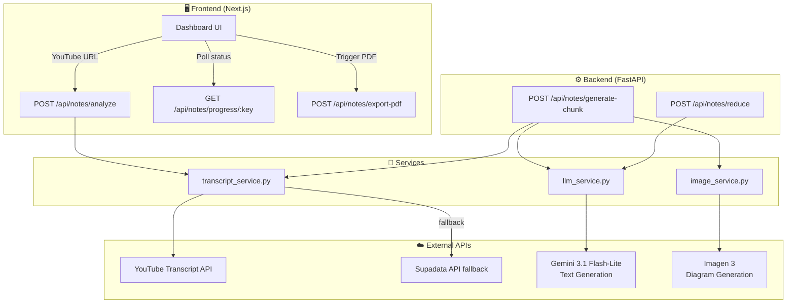
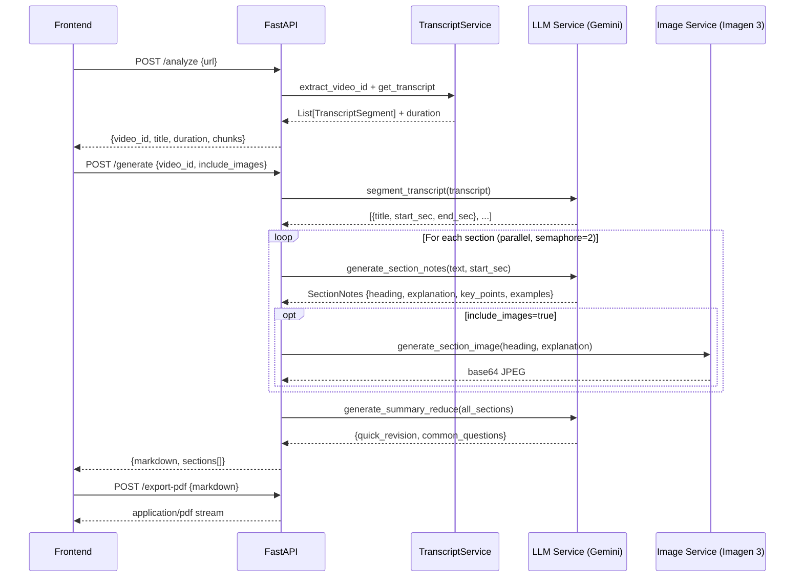

# 📚 Personal Notes Generator

> **AI-powered lecture notes from any YouTube video** — transcription → segmentation → structured study notes → educational diagrams → PDF export.

Built with **FastAPI** + **Gemini 3.1 Flash-Lite** (text) + **Imagen 3** (diagrams) + **Next.js**.

---

## ✨ Features

| Feature | Description |
|---|---|
| 🎬 **Auto Transcript** | Fetches captions via `youtube-transcript-api`, falls back to Supadata API |
| 🧠 **AI Segmentation** | Gemini 3.1 Flash-Lite splits transcript into logical topic sections |
| 📝 **Rich Notes** | Per-section: heading, detailed explanation, key takeaways, examples |
| 🖼️ **Diagram Generation** | Imagen 3 generates a labelled educational diagram per section |
| ⚡ **Quick Revision** | Gemini synthesises a 200-word cohesive lecture summary |
| ❓ **Exam Questions** | 6-8 interview/exam Q&As with answer guidelines |
| 📄 **PDF Export** | One-click styled PDF via xhtml2pdf |
| 🔄 **Long Video Support** | Chunked pipeline for videos > 30 minutes |
| 📊 **Progress Tracking** | Real-time status via polling endpoint |

---

## 🏗️ Architecture



---

## 🔄 Request Flow — Short Video



---

## 🔄 Request Flow — Long Video (Chunked)

```mermaid
flowchart LR
    A[YouTube URL\n> 30 min video] --> B[/analyze\nPartitions into chunks]
    B --> C{For each chunk}
    C --> D[/generate-chunk\nstart_sec, end_sec]
    D --> E[Transcript slice]
    E --> F[Gemini segments\ntopic sections]
    F --> G[Notes per section\n+ Imagen diagrams]
    G --> H[Chunk markdown]
    C --> |all chunks done| I[/reduce\nSectionSummary list]
    I --> J[Quick Revision\n+ Exam Questions]
    J --> K[Full Notes\nMarkdown]
    K --> L[/export-pdf\nPDF download]
```

---

## 📁 Project Structure

```
personal_notes_gen/
├── backend/
│   ├── app/
│   │   ├── core/
│   │   │   └── config.py          # Pydantic settings (env vars)
│   │   ├── models/
│   │   │   └── schemas.py         # Request/Response Pydantic models
│   │   ├── routers/
│   │   │   └── notes.py           # All API endpoints
│   │   ├── services/
│   │   │   ├── llm_service.py     # Gemini 3.1 Flash-Lite text generation
│   │   │   ├── image_service.py   # Imagen 3 diagram generation
│   │   │   ├── transcript_service.py  # YouTube transcript fetching
│   │   │   └── notion_service.py  # (optional) Notion export
│   │   └── main.py                # FastAPI app entry point
│   ├── .env                       # API keys (never commit)
│   ├── .env.example               # Template
│   └── requirements.txt
└── frontend/
    ├── app/
    │   ├── page.tsx               # Main dashboard
    │   └── globals.css            # Global styles
    └── package.json
```

---

## ⚙️ Setup

### 1. Clone & Backend Setup

```bash
git clone <repo-url>
cd personal_notes_gen/backend

# Create virtual environment
python -m venv venv
venv\Scripts\activate          # Windows
# source venv/bin/activate     # macOS/Linux

pip install -r requirements.txt
```

### 2. Environment Variables

Copy `.env.example` to `.env` and fill in your keys:

```bash
cp .env.example .env
```

```env
# Gemini Flash — text generation (notes, segmentation, summaries)
GEMINI_API_KEY_FORTEXT=your_gemini_key_for_text

# Imagen 3 — educational diagram generation per section
GEMINI_API_KEY=your_gemini_key_for_images

# Supadata — fallback transcript fetcher if YouTube captions unavailable
SUPADATA_API_KEY=your_supadata_key

# App
PORT=8000
HOST=127.0.0.1
```

> Get Gemini keys from: https://aistudio.google.com/app/apikey  
> Get Supadata key from: https://supadata.ai

### 3. Run Backend

```bash
cd backend
uvicorn app.main:app --reload
# Runs on http://127.0.0.1:8000
# API docs: http://127.0.0.1:8000/docs
```

### 4. Run Frontend

```bash
cd frontend
npm install
npm run dev
# Runs on http://localhost:3000
```

---

## 🌐 API Reference

### `POST /api/notes/analyze`
Extracts video metadata and partitions long videos into chunks.

```json
// Request
{ "url": "https://youtube.com/watch?v=...", "chunk_size_mins": 30 }

// Response
{
  "video_id": "abc123",
  "title": "Feature Scaling – Standardization",
  "duration": 1234.5,
  "is_long": false,
  "chunks": [{ "part": 1, "start_sec": 0, "end_sec": 1234.5 }]
}
```

### `POST /api/notes/generate`
Full pipeline for short videos (≤ 30 min).

```json
// Request
{ "video_id": "abc123", "include_images": true }

// Response
{ "markdown": "# Full Notes...", "sections": [...] }
```

### `POST /api/notes/generate-chunk`
Chunked pipeline for long videos.

```json
// Request
{ "video_id": "abc123", "start_sec": 0, "end_sec": 1800, "include_images": false }
```

### `GET /api/notes/progress/{task_key}`
Poll real-time generation status.

```json
{ "task_key": "abc123_0_1800", "status": "Generating notes" }
```

### `POST /api/notes/reduce`
Generates Quick Revision + Exam Questions from compiled section summaries.

### `POST /api/notes/export-pdf`
Converts markdown to a styled PDF stream.

---

## 🛠️ Tech Stack

| Layer | Technology |
|---|---|
| **Backend Framework** | FastAPI + Uvicorn |
| **Text AI** | Google Gemini 3.1 Flash-Lite (`gemini-3.1-flash-lite`) |
| **Image AI** | Google Imagen 3 (`imagen-3.0-generate-002`) |
| **Transcription** | youtube-transcript-api + Supadata fallback |
| **PDF Generation** | xhtml2pdf |
| **Retry Logic** | Tenacity (exponential backoff) |
| **Config** | Pydantic-Settings |
| **Frontend** | Next.js |

---

## 🔑 Key Design Decisions

- **Gemini over Groq** — Gemini 3.1 Flash-Lite has a larger context window and integrated image generation ecosystem (Imagen 3), enabling a single-provider AI pipeline.
- **Dual API keys** — Text and image generation use separate keys to allow independent rate-limit management and billing control.
- **Token budgeting** — Transcripts are sampled/truncated before LLM calls to stay within TPM limits (`MAX_SEGMENT_CHARS=8000`, `MAX_SECTION_CHARS=5000`).
- **Async-safe Imagen** — Imagen 3 SDK is synchronous; wrapped in `run_in_executor` to avoid blocking the FastAPI event loop.
- **Chunked pipeline** — Videos > 30 min are partitioned at natural speech gaps (largest inter-segment pause within ±3 min of each chunk boundary).

---

## 📜 License

MIT
