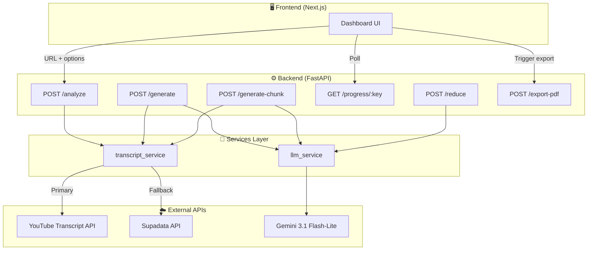
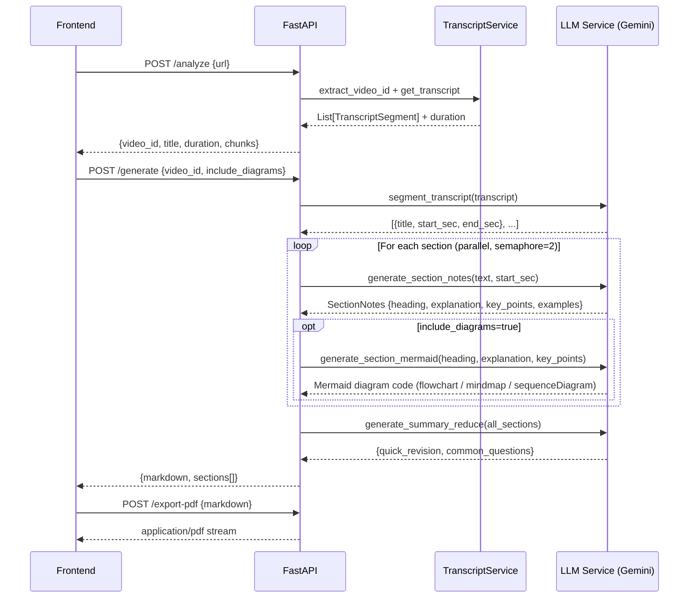
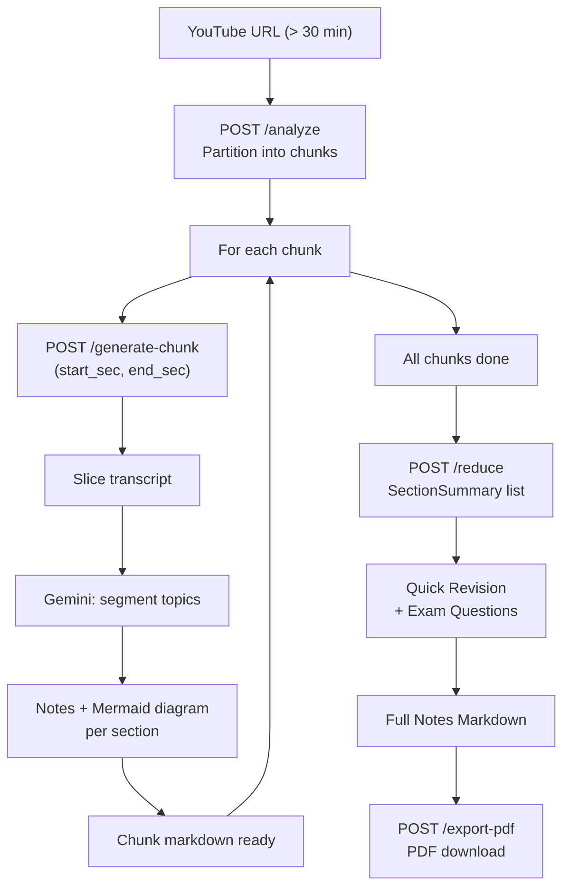

<div align="center">

# 📚 Personal Notes Generator

**Transform any YouTube lecture into structured, exam-ready study notes — powered by AI.**

[](https://fastapi.tiangolo.com)
[](https://nextjs.org)
[](https://aistudio.google.com)
[](https://mermaid.js.org)
[](LICENSE)

> Paste a YouTube URL → get segmented topic notes, AI-generated Mermaid diagrams, a quick revision summary, exam Q&As, and a one-click PDF — all in seconds.

</div>

---

## ✨ Features

| Feature | Description |
|---|---|
| 🎬 **Auto Transcript** | Fetches captions via `youtube-transcript-api`, falls back to Supadata API |
| 🧠 **AI Segmentation** | Gemini splits transcript into 3–8 logical topic sections |
| 📝 **Rich Notes** | Per-section: heading, detailed explanation, key takeaways, examples |
| 📊 **Mermaid Diagrams** | AI-generated `flowchart`, `mindmap`, or `sequenceDiagram` per section, rendered client-side |
| ⚡ **Quick Revision** | Gemini synthesises a 200–300-word cohesive lecture summary |
| ❓ **Exam Questions** | 6–8 interview/exam Q&As with answer guidelines |
| 📄 **PDF Export** | One-click styled PDF via `xhtml2pdf` |
| 🔄 **Long Video Support** | Chunked pipeline for videos > 30 minutes |
| 📡 **Progress Tracking** | Real-time status via polling endpoint |

---

## 🏗️ System Architecture



---

## 🔄 Request Flow — Short Video



---

## 🔄 Request Flow — Long Video (Chunked)



---

## 📁 Project Structure

```
personal_notes_gen/
├── backend/
│   ├── app/
│   │   ├── core/
│   │   │   └── config.py              # Pydantic settings (env vars)
│   │   ├── models/
│   │   │   └── schemas.py             # Request/Response Pydantic models
│   │   ├── routers/
│   │   │   └── notes.py               # All API endpoints
│   │   ├── services/
│   │   │   ├── llm_service.py         # Gemini text generation + Mermaid diagrams
│   │   │   ├── transcript_service.py  # YouTube transcript fetching
│   │   │   └── notion_service.py      # (optional) Notion export
│   │   └── main.py                    # FastAPI app entry point
│   ├── .env                           # API keys — never commit!
│   ├── .env.example                   # Template for new developers
│   └── requirements.txt
└── frontend/
    ├── app/
    │   ├── page.tsx                   # Main dashboard
    │   └── globals.css                # Global styles
    └── package.json
```

---

## ⚙️ Setup & Installation

### 1. Clone & Backend Setup

```bash
git clone <repo-url>
cd personal_notes_gen/backend

# Create virtual environment
python -m venv venv
venv\Scripts\activate          # Windows
# source venv/bin/activate     # macOS / Linux

pip install -r requirements.txt
```

### 2. Environment Variables

Copy `.env.example` to `.env` and fill in your keys:

```bash
cp .env.example .env
```

```env
# Gemini Flash — text generation (notes, segmentation, summaries, Mermaid diagrams)
GEMINI_API_KEY_FORTEXT=your_gemini_key_for_text

# Supadata — fallback transcript fetcher if YouTube captions are unavailable
SUPADATA_API_KEY=your_supadata_key

# App server
PORT=8000
HOST=127.0.0.1
```

> 🔑 **Get Gemini API key:** https://aistudio.google.com/app/apikey
> 🔑 **Get Supadata key:** https://supadata.ai

### 3. Run Backend

```bash
cd backend
uvicorn app.main:app --reload
# API server → http://127.0.0.1:8000
# Interactive docs → http://127.0.0.1:8000/docs
```

### 4. Run Frontend

```bash
cd frontend
npm install
npm run dev
# App → http://localhost:3000
```

---

## 🌐 API Reference

### `POST /api/notes/analyze`
Extracts video metadata and partitions long videos into time-bounded chunks.

```json
// Request
{ "url": "https://youtube.com/watch?v=...", "chunk_size_mins": 30 }

// Response
{
  "video_id": "abc123",
  "title": "Feature Scaling – Standardization",
  "duration": 1234.5,
  "is_long": false,
  "chunks": [{ "part": 1, "start_sec": 0, "end_sec": 1234.5 }]
}
```

### `POST /api/notes/generate`
Full pipeline for short videos (≤ 30 min). Returns notes + Mermaid diagrams.

```json
// Request
{ "video_id": "abc123", "include_diagrams": true }

// Response
{ "markdown": "# Full Notes...", "sections": [...] }
```

### `POST /api/notes/generate-chunk`
Chunked pipeline for long videos — processes one time window at a time.

```json
// Request
{ "video_id": "abc123", "start_sec": 0, "end_sec": 1800, "include_diagrams": true }
```

### `GET /api/notes/progress/{task_key}`
Poll real-time generation status.

```json
{ "task_key": "abc123_0_1800", "status": "Generating notes for section 3..." }
```

### `POST /api/notes/reduce`
Generates Quick Revision + Exam Questions from compiled section summaries.

### `POST /api/notes/export-pdf`
Converts final markdown to a styled, downloadable PDF stream.

---

## 🛠️ Tech Stack

| Layer | Technology |
|---|---|
| **Backend Framework** | FastAPI + Uvicorn |
| **Text & Diagram AI** | Google Gemini 3.1 Flash-Lite (`gemini-3.1-flash-lite`) |
| **Transcription** | `youtube-transcript-api` |
| **PDF Generation** | `xhtml2pdf` |
| **Retry Logic** | Tenacity (exponential backoff) |
| **Config Management** | Pydantic-Settings |
| **Frontend** | Next.js (App Router) |

---

## 🔑 Key Design Decisions

- **Mermaid over Imagen** — Switched from Imagen 3 image generation to Mermaid diagram code, which is faster, free of API-key overhead, always on-topic, and renders natively in the browser with zero extra cost.
- **Single Gemini key** — All AI tasks (segmentation, notes, diagrams, summaries) share one `GEMINI_API_KEY_FORTEXT`, simplifying secret management.
- **Token budgeting** — Transcripts are sampled/truncated before each LLM call to stay within TPM limits (`MAX_SEGMENT_CHARS=8000`, `MAX_SECTION_CHARS=5000`, `MAX_SUMMARY_CHARS=10000`).
- **Async-safe concurrency** — Sections are generated in parallel with an `asyncio.Semaphore(2)` to balance throughput against rate limits.
- **Chunked pipeline** — Videos > 30 min are partitioned at natural speech gaps (largest inter-segment pause within ±3 min of each chunk boundary), enabling progress tracking per chunk.
- **Resilient transcription** — Primary YouTube captions fall back to Supadata API automatically, covering videos where auto-captions are disabled.

---

## 📜 License

MIT © 2026
